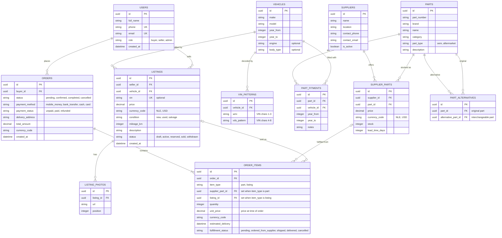

# Salon AutoZone

Car parts and car sales for the Sierra Leone market. Buyers can find parts that fit their vehicle (by VIN), order them from local suppliers, and browse vehicles listed for sale by other users.

## AI Parts Finder Assistant

The marketplace includes an AI-style parts finder that turns a VIN or vehicle description into a ranked list of compatible parts and supplier offers.

It works by:

- resolving the vehicle from the VIN and `VIN_PATTERNS` table;
- matching compatible parts through `PART_FITMENTS` and `PARTS`;
- checking live stock and lead times in `SUPPLIER_PARTS`;
- suggesting alternatives via `PART_ALTERNATIVES` when the OEM or preferred part is unavailable;
- ranking offers by stock, lead time, and purchase price to surface the best match first.

This makes the assistant useful for both natural-language requests and structured catalog browsing, while keeping all pricing, fitment, and supplier data grounded in the same transactional schema.

## Database Schema



### Design Notes

**Catalog vs. inventory.** `PARTS` is the catalog: what a part is. `SUPPLIER_PARTS` is inventory: who sells it, at what price, with how much stock, and how long delivery takes. The same part can be offered by several suppliers at different prices.

**Fitment.** A part usually fits many vehicles, so compatibility lives in `PART_FITMENTS` rather than on the part. Each row can carry its own year range, since a part may only fit some model years.

**Vehicle catalog vs. vehicle for sale.** `VEHICLES` describes a make/model/year range. A specific car for sale is a row in `LISTINGS`, which carries its own VIN, mileage, photos and price.

**VIN decoding.** `VIN_PATTERNS` maps the manufacturer code (`wmi`) and descriptor section (`vds_pattern`) to a `VEHICLES` row. The model year is read from the VIN's 10th character. If data coverage is thin, a third-party VIN decoder API can sit in front of this table.

**OEM and aftermarket.** `PARTS.part_type` marks a part as OEM or aftermarket. `PART_ALTERNATIVES` links interchangeable parts, so an out-of-stock OEM part can point to aftermarket options. Alternatives are only offered if they also have a matching `PART_FITMENTS` row for the buyer's vehicle.

**Currency.** Prices are stored as `decimal(12,2)` with an explicit `currency_code` such as `NLE` or `USD`. Never store a price without its currency. Convert at display or checkout time using a stored exchange rate, and keep the rate used on the order.

**Orders and carts.** An order is a cart: one buyer, one payment, and many `ORDER_ITEMS`. Each item snapshots `unit_price` so later price changes do not rewrite history. Parts can come from different suppliers within one order, so supplier and delivery estimate are tracked per item through `supplier_part_id`.

### Database Constraints

```sql
-- Exactly one of supplier_part_id / listing_id per order item
ALTER TABLE order_items ADD CONSTRAINT order_items_one_target CHECK (
  (item_type = 'part' AND supplier_part_id IS NOT NULL AND listing_id IS NULL) OR
  (item_type = 'listing' AND listing_id IS NOT NULL AND supplier_part_id IS NULL)
);

-- One offer per supplier per part
ALTER TABLE supplier_parts ADD CONSTRAINT supplier_parts_unique
  UNIQUE (supplier_id, part_id);

-- A brand's part number is unique, not the number alone
ALTER TABLE parts ADD CONSTRAINT parts_brand_number_unique
  UNIQUE (brand, part_number);

-- No negative stock
ALTER TABLE supplier_parts ADD CONSTRAINT supplier_parts_stock_nonneg
  CHECK (stock >= 0);
```

Use native enum types or check constraints for every value-list column: `role`, `condition`, `status`, `part_type`, `payment_method`, `payment_status`, and `fulfillment_status`.

## Ordering Flow

### Buying Parts

1. **Identify the vehicle.** The buyer enters a VIN. The app matches it against `VIN_PATTERNS` and resolves a `VEHICLES` row, plus the model year. If there is no match, fall back to a manual make, model, and year picker.
2. **Load compatible parts.** Query `PART_FITMENTS` for that vehicle, keeping rows whose `year_from` and `year_to` include the model year, and join to `PARTS`.
3. **Check availability.** For each part, look up `SUPPLIER_PARTS` where `stock > 0`. Show the best offer by price or lead time and let the buyer compare others.
4. **In stock: immediate checkout.** The buyer adds the offer to the cart. Estimated delivery is today plus the offer's `lead_time_days`.
5. **Out of stock: offer alternatives.** If no supplier has stock, look up `PART_ALTERNATIVES` for the part, keep only alternatives that also fit this vehicle, and show their in-stock offers. Show `lead_time_days` as the delivery estimate. The buyer can pick an alternative or order the original for later delivery.
6. **Place the order.** In one database transaction:
   - create the `ORDERS` row with `payment_status = unpaid`;
   - create one `ORDER_ITEMS` row per item, snapshotting `unit_price`, `currency_code`, and `estimated_delivery`;
   - decrement `SUPPLIER_PARTS.stock` for in-stock items;
   - set `total_amount`.
7. **Fulfil.** Each item moves through `fulfillment_status`: `pending` -> `ordered_from_supplier` -> `shipped` -> `delivered` or `cancelled`. The order is `completed` when every item is delivered or cancelled.

### Buying a Vehicle

1. A seller creates a `LISTINGS` row linked to a `VEHICLES` catalog entry and adds photos in `LISTING_PHOTOS`. Setting `status = active` publishes it.
2. A buyer places an order containing one `ORDER_ITEMS` row with `item_type = listing` and `quantity = 1`.
3. The listing moves to `reserved` on order creation and `sold` once the order is completed. If the order is cancelled, it returns to `active`.

## Scope

`LISTINGS` covers whole vehicles only. Sellers listing used parts is a possible later addition; it would add a `listing_type` column and a nullable `part_id` on `LISTINGS`.
